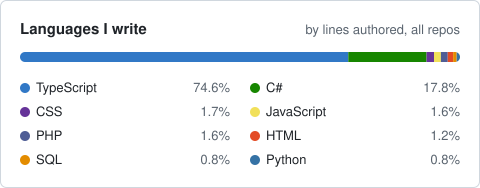

### Hi, I'm Akhil Johns

> Make it work, make it right, make it fast. — Kent Beck

---

## Stack

   
  

## How I build

- **Feature-driven structure.** Each feature owns its API, components, hooks and schema.
- **Strict TypeScript** and schema validation at every boundary.
- **Server state, client state and form state kept apart.** TanStack Query for the first, never mixed.
- **Tested against the real database**, not only fakes. Loading, empty and error states count as done criteria.

---

## Activity

  

  <picture>
    <source media="(prefers-color-scheme: dark)" srcset="https://github-readme-streak-stats.herokuapp.com/?user=akhiljohns&theme=github-dark-blue&hide_border=true" />
    
  </picture>

